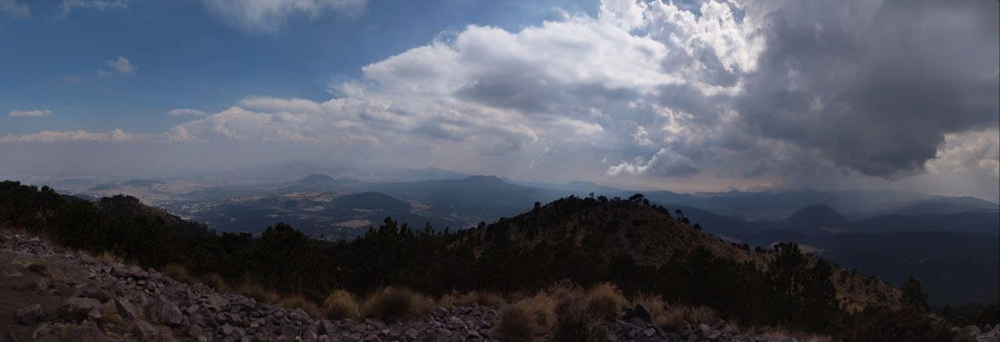
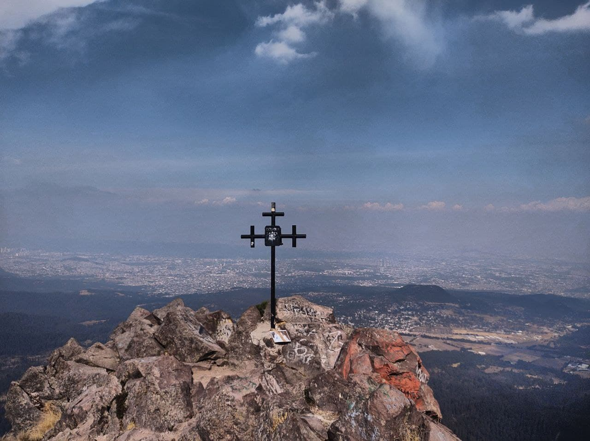
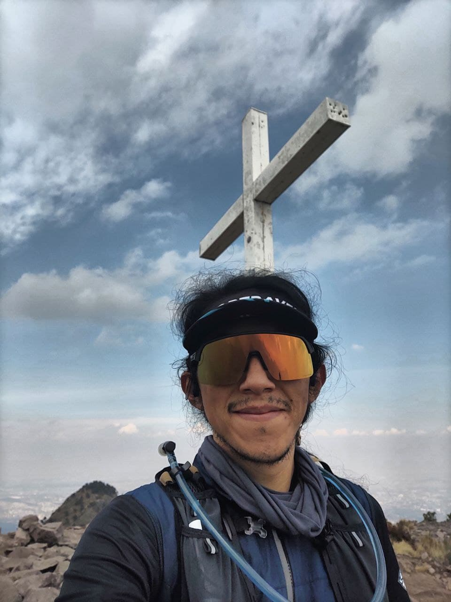

# Mis carreras para este 2022

Las pasiones en este momento de mi vida son diversas. Para mí es muy complicado centrarme en una sola cosa y además tener que comprometerle a darle toda mi atención, me conflictúa demasiado.
Algunas personas han externado conmigo una su preocupación ya que, como dijo un conocido por allá del 2013, soy _un claudicador profesional_. Cuando algo no me gusta lo abandono, no tiene sentido para mí hacer algo que no me gusta; no me importa si ya casi voy a acabar: para mí el costo de hacer algo que no me guste o que no le encuentre sentido así me falte
solamente un 5% representa un esfuerzo del 200% y no estoy dispuesto a hacerlo. Ojo, hay excepciones, **hay cosas que se tienen que hacer**: hacer el proceso para sacar un pasaporte, cambiar
la dirección de tu cédula, ir al banco... y un sin fin de cosas más que se tienen que hacer. 

¿Por qué platicar lo anterior?...

Este año lo inicié con una carrera: [_La clásica de Reyes_](https://www.strava.com/activities/6463099603). Así fue el inicio de mi año. La carrera comenzó en [Plaza Santa Teresa](https://www.google.com/maps/place/Plaza+Santa+Teresa/@19.3080905,-99.2136763,15z/data=!4m2!3m1!1s0x0:0xa005e07d3e8be616?sa=X&ved=2ahUKEwjvmLPp_qz1AhVxlGoFHeUiBzkQ_BJ6BAg9EAU) y terminó en el [Valle de las Cantimploras](https://goo.gl/maps/42zLnpzXC5Honvd28). Fueron 35KM con una elevación positiva de 1,224M. Gran carrera. 

El asunto es que decidí pegarme al grupo puntero. Éste decidió desde el inicio agarrar un ritmo bien duro, más o menos 22 KM/H, el 2-qrt (mediana) del gradiente es más o menos 4.9% . Decidí pegarme a ellos y no soltarlos pero en algún momento de ese recorrido comencé a notar que mi corazón estaba latiendo fuerte y aunque no estaba en mi máximo eso era una señal de que si seguía a ese ritmo me iba a quedar sin capacidad cardio-respiratoria antes de acabar con el glucógeno de mis músculos y sangre. Así decidí escuchar a mi cuerpo: subí un piñón y conservé mi cadencia (~98rpm). A partir del KM 14 el grupo puntero comenzó a abrirme distancia; cada segundo le veía más lejos hasta que en un semáforo nos separamos cerca de 1KM. Desde ese momento tenía dos objetivos: no dejarme comer por el pelotón y hacer la mejor carrera posible. Allá a lo lejos veía al grupo puntero, también veía como poco a poco se iba rompiendo. Mi meta era llegar en el top 50 de mi categoría.

Hace dos meses mi entrenadora lazó de manera casi retórica una pregunta. En ella me hacía cuestionarme el porqué en las carreras seguía, el porqué salía a entrenar cada día. La verdad no tengo una respuesta concreta pero me di cuenta de algo importante: no lo hago por algo específico. La carrera o el entrenamiento no son para mí en sí mismos un fin, son un medio. Son el medio por el cual puedo conectar con la naturaleza, con mis pensamientos, con mis sentimientos y llegar a un equilibrio. Es una forma en la que me puedo comunicar y puedo imaginar. Por ejemplo, hace unos días hice un ascenso al Ajusco, esto es pasar al [pico del águila](https://goo.gl/maps/AgcyJfMkVBy9hD3S8) y a la [cruz del marqués](https://goo.gl/maps/j9QVjr3yAvhtkQyn9). Mi ritmo medio fue de 11min/km -lo cual parecería lento pero hay que tomar en cuenta que esto es en trail y las cuestas son de 4KM con un gradiente medio de 22%- y mientras iba ahí me desconecté de todo, yo imaginaba que era simplemente Mowgli moviéndome en la naturaleza, los caminos eran bien claros para mí: sabía donde pisar, dónde esquivar y dónde escalar. Fue tan divertido que de pronto, en regreso al pico del águila desde cruz del marqués, me encontré acompañado por dos perros que salieron de la nada. Íbamos corriendo entre nosotros tres, de repente me rebasaban y de momento yo a ellos. Fue muy divertido. Entrenar o competir es un medio para llegar a ese equilibrio, a ese estado. 

El chiste de todo esto es que, aún cuando mi corazón, mis pulmones o mis músculos no pueden no he pensado en renunciar, no me ha pasado por la cabeza. Incluso en sí mismas las carreras y la competencia no me impulsan, simplemente son un medio para poder convivir con otras personas y, como me pasó con los perros en el Ajusco, poder jugar. Las metas son lugares tristes.

No me malentiendan, es muy divertido llegar al podio y que la gente con la que corriste te animen pero la realidad es que al aplauso dura un segundo y las carreras regularmente duran más. Al final el cambio no lo vale, para mí vale más la carrera. Supongo que tiene que ver también con que regularmente entreno solo.

## Mis carreras este año

Después de todo lo 