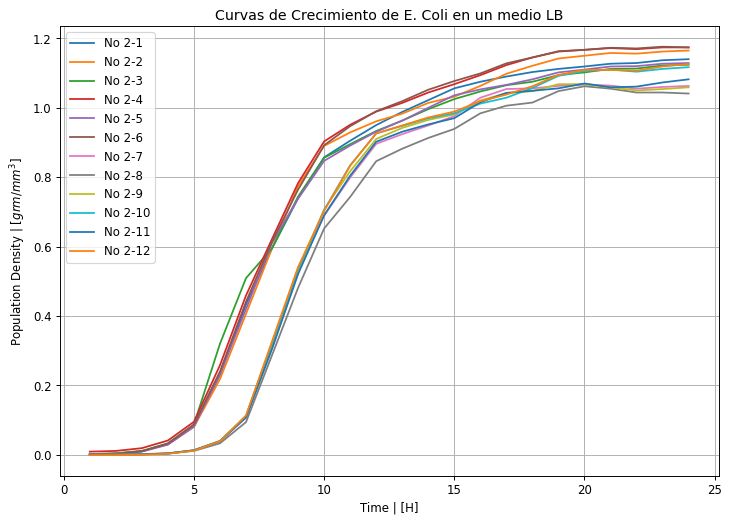
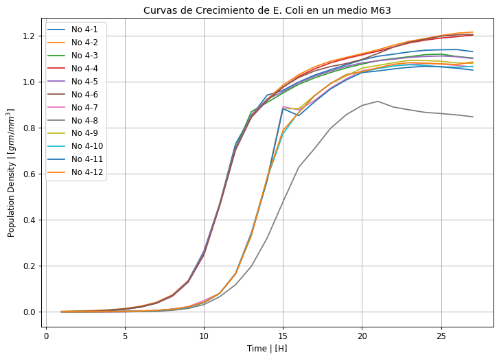
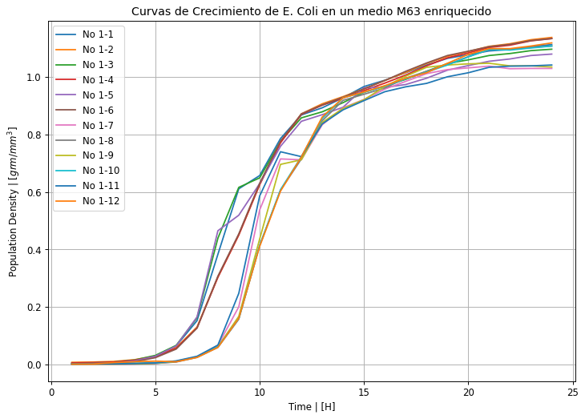
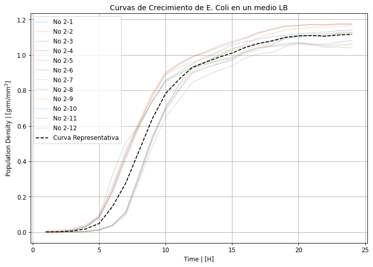
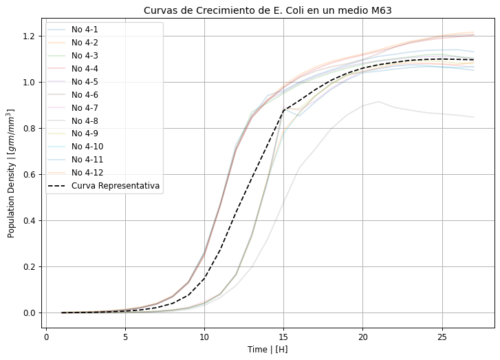
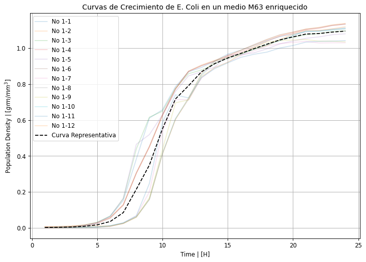

# Ajuste de parámetros a datos experimentales.  

## Overview 

A lo largo del este notebook se van a explorar tres técnicas de ajuste de datos, en particular se hará enfásis en mínimos cuadrados y un método no-lineal para determianr parámetros de modelos de crecimiento exponencial y lógistico. 

Los datos se pueden encontrar en [2], este conjunto de datos se generó para realizar un análisis de correlación entre la represión/supresión de genes en poblaciones de [_E. coli_](https://es.wikipedia.org/wiki/Escherichia_coli), variación del ambiente de las poblaciones y su crecimiento. Es decir, si modificar el DNA de E. coli puede hacer que cambien sus patrones de crecimiento en ambiente controlados. El objetivo del notebook no es una reproducción del análisis de correlación, sin embargo usaremos un par de hechos presentados en el artículo. De cualquier manera, se invita a indagar en los resultados presentados en [1].

## Gráficas, datos y python. 

El lenguaje de programación en el que desarrollaremos esta suerte de ejercicios es Python 3 (es reproducbile para kernel de Python >3.3) y se hará uso de las librerías [Matplolib](https://matplotlib.org/stable/gallery/) para visualización de datos, [Numpy](https://numpy.org/doc/stable/user/absolute_beginners.html) para manejo de datos y operaciones algebraicas, y [Pandas](https://pandas.pydata.org/docs/user_guide/index.html) para la carga y el manejo de bases de datos. 

Se comenzará importando estas librerías a Python:


```python
import matplotlib.pyplot as plt
import pandas as pd
import numpy as np
```

Lo siguiente que realizaremos será leer la información de nuestras bases de datos.


```python
df_lb = pd.read_csv(filepath_or_buffer = 'E. coli growth curve data by strain for LB (rich medium) - No.2 (n=12).csv')
```

Para revisar que la data se cargó de manera correcta podemos hacer una inspección del encabezado (primeras n-filas) o de la cola (últimas n-filas) del _dataframe_:


```python
df_lb.head()
```


<div>
<style scoped>
    .dataframe tbody tr th:only-of-type {
        vertical-align: middle;
    }

    .dataframe tbody tr th {
        vertical-align: top;
    }

    .dataframe thead th {
        text-align: right;
    }
</style>
<table border="1" class="dataframe">
  <thead>
    <tr style="text-align: right;">
      <th></th>
      <th>time (h)</th>
      <th>No 2-1</th>
      <th>No 2-2</th>
      <th>No 2-3</th>
      <th>No 2-4</th>
      <th>No 2-5</th>
      <th>No 2-6</th>
      <th>No 2-7</th>
      <th>No 2-8</th>
      <th>No 2-9</th>
      <th>No 2-10</th>
      <th>No 2-11</th>
      <th>No 2-12</th>
    </tr>
  </thead>
  <tbody>
    <tr>
      <th>0</th>
      <td>1</td>
      <td>0.001</td>
      <td>0.002</td>
      <td>0.002</td>
      <td>0.009</td>
      <td>0.001</td>
      <td>0.001</td>
      <td>0.000</td>
      <td>0.001</td>
      <td>-0.001</td>
      <td>-0.001</td>
      <td>0.000</td>
      <td>-0.001</td>
    </tr>
    <tr>
      <th>1</th>
      <td>2</td>
      <td>0.003</td>
      <td>0.004</td>
      <td>0.004</td>
      <td>0.011</td>
      <td>0.003</td>
      <td>0.003</td>
      <td>0.000</td>
      <td>0.001</td>
      <td>0.000</td>
      <td>0.000</td>
      <td>0.000</td>
      <td>-0.001</td>
    </tr>
    <tr>
      <th>2</th>
      <td>3</td>
      <td>0.010</td>
      <td>0.011</td>
      <td>0.011</td>
      <td>0.019</td>
      <td>0.009</td>
      <td>0.010</td>
      <td>0.001</td>
      <td>0.002</td>
      <td>0.001</td>
      <td>0.001</td>
      <td>0.001</td>
      <td>0.000</td>
    </tr>
    <tr>
      <th>3</th>
      <td>4</td>
      <td>0.031</td>
      <td>0.030</td>
      <td>0.033</td>
      <td>0.041</td>
      <td>0.029</td>
      <td>0.032</td>
      <td>0.004</td>
      <td>0.004</td>
      <td>0.003</td>
      <td>0.003</td>
      <td>0.004</td>
      <td>0.003</td>
    </tr>
    <tr>
      <th>4</th>
      <td>5</td>
      <td>0.082</td>
      <td>0.080</td>
      <td>0.087</td>
      <td>0.095</td>
      <td>0.081</td>
      <td>0.087</td>
      <td>0.013</td>
      <td>0.011</td>
      <td>0.012</td>
      <td>0.013</td>
      <td>0.013</td>
      <td>0.012</td>
    </tr>
  </tbody>
</table>
</div>


```python
df_lb.tail()
```


<div>
<style scoped>
    .dataframe tbody tr th:only-of-type {
        vertical-align: middle;
    }

    .dataframe tbody tr th {
        vertical-align: top;
    }

    .dataframe thead th {
        text-align: right;
    }
</style>
<table border="1" class="dataframe">
  <thead>
    <tr style="text-align: right;">
      <th></th>
      <th>time (h)</th>
      <th>No 2-1</th>
      <th>No 2-2</th>
      <th>No 2-3</th>
      <th>No 2-4</th>
      <th>No 2-5</th>
      <th>No 2-6</th>
      <th>No 2-7</th>
      <th>No 2-8</th>
      <th>No 2-9</th>
      <th>No 2-10</th>
      <th>No 2-11</th>
      <th>No 2-12</th>
    </tr>
  </thead>
  <tbody>
    <tr>
      <th>19</th>
      <td>20</td>
      <td>1.119</td>
      <td>1.150</td>
      <td>1.102</td>
      <td>1.167</td>
      <td>1.110</td>
      <td>1.167</td>
      <td>1.067</td>
      <td>1.062</td>
      <td>1.068</td>
      <td>1.106</td>
      <td>1.070</td>
      <td>1.109</td>
    </tr>
    <tr>
      <th>20</th>
      <td>21</td>
      <td>1.127</td>
      <td>1.158</td>
      <td>1.112</td>
      <td>1.172</td>
      <td>1.119</td>
      <td>1.173</td>
      <td>1.064</td>
      <td>1.055</td>
      <td>1.059</td>
      <td>1.110</td>
      <td>1.059</td>
      <td>1.109</td>
    </tr>
    <tr>
      <th>21</th>
      <td>22</td>
      <td>1.129</td>
      <td>1.156</td>
      <td>1.113</td>
      <td>1.169</td>
      <td>1.120</td>
      <td>1.171</td>
      <td>1.055</td>
      <td>1.044</td>
      <td>1.050</td>
      <td>1.104</td>
      <td>1.061</td>
      <td>1.107</td>
    </tr>
    <tr>
      <th>22</th>
      <td>23</td>
      <td>1.137</td>
      <td>1.162</td>
      <td>1.122</td>
      <td>1.174</td>
      <td>1.127</td>
      <td>1.176</td>
      <td>1.060</td>
      <td>1.044</td>
      <td>1.054</td>
      <td>1.112</td>
      <td>1.073</td>
      <td>1.119</td>
    </tr>
    <tr>
      <th>23</th>
      <td>24</td>
      <td>1.140</td>
      <td>1.165</td>
      <td>1.124</td>
      <td>1.174</td>
      <td>1.129</td>
      <td>1.174</td>
      <td>1.063</td>
      <td>1.041</td>
      <td>1.059</td>
      <td>1.117</td>
      <td>1.082</td>
      <td>1.126</td>
    </tr>
  </tbody>
</table>
</div>


Cargemos el resto de bases:


```python
df_m63 = pd.read_csv(filepath_or_buffer = 'E. coli growth curve data by strain for M63 (minimal medium) - No.4 (n=12).csv')
df_maa = pd.read_csv(filepath_or_buffer = 'E. coli growth curve data by strain for MAA (M63 supplied with 20 amino acids) - No.1 (n=12).csv')
```

Revisemos de nuevo los datos:


```python
df_m63.head()
```


<div>
<style scoped>
    .dataframe tbody tr th:only-of-type {
        vertical-align: middle;
    }

    .dataframe tbody tr th {
        vertical-align: top;
    }

    .dataframe thead th {
        text-align: right;
    }
</style>
<table border="1" class="dataframe">
  <thead>
    <tr style="text-align: right;">
      <th></th>
      <th>time (h)</th>
      <th>No 4-1</th>
      <th>No 4-2</th>
      <th>No 4-3</th>
      <th>No 4-4</th>
      <th>No 4-5</th>
      <th>No 4-6</th>
      <th>No 4-7</th>
      <th>No 4-8</th>
      <th>No 4-9</th>
      <th>No 4-10</th>
      <th>No 4-11</th>
      <th>No 4-12</th>
    </tr>
  </thead>
  <tbody>
    <tr>
      <th>0</th>
      <td>1</td>
      <td>0.000</td>
      <td>0.001</td>
      <td>0.001</td>
      <td>-0.001</td>
      <td>-0.001</td>
      <td>-0.002</td>
      <td>-0.003</td>
      <td>-0.002</td>
      <td>-0.001</td>
      <td>0.000</td>
      <td>0.000</td>
      <td>0.000</td>
    </tr>
    <tr>
      <th>1</th>
      <td>2</td>
      <td>0.001</td>
      <td>0.003</td>
      <td>0.002</td>
      <td>0.001</td>
      <td>0.001</td>
      <td>0.000</td>
      <td>-0.003</td>
      <td>-0.002</td>
      <td>-0.001</td>
      <td>0.000</td>
      <td>0.000</td>
      <td>0.001</td>
    </tr>
    <tr>
      <th>2</th>
      <td>3</td>
      <td>0.003</td>
      <td>0.005</td>
      <td>0.003</td>
      <td>0.002</td>
      <td>0.002</td>
      <td>0.002</td>
      <td>-0.002</td>
      <td>-0.002</td>
      <td>-0.001</td>
      <td>0.000</td>
      <td>0.000</td>
      <td>0.001</td>
    </tr>
    <tr>
      <th>3</th>
      <td>4</td>
      <td>0.007</td>
      <td>0.008</td>
      <td>0.007</td>
      <td>0.006</td>
      <td>0.005</td>
      <td>0.005</td>
      <td>-0.002</td>
      <td>-0.001</td>
      <td>0.000</td>
      <td>0.001</td>
      <td>0.001</td>
      <td>0.001</td>
    </tr>
    <tr>
      <th>4</th>
      <td>5</td>
      <td>0.012</td>
      <td>0.014</td>
      <td>0.012</td>
      <td>0.011</td>
      <td>0.010</td>
      <td>0.011</td>
      <td>-0.001</td>
      <td>-0.001</td>
      <td>0.001</td>
      <td>0.001</td>
      <td>0.002</td>
      <td>0.002</td>
    </tr>
  </tbody>
</table>
</div>


```python
df_maa.tail()
```


<div>
<style scoped>
    .dataframe tbody tr th:only-of-type {
        vertical-align: middle;
    }

    .dataframe tbody tr th {
        vertical-align: top;
    }

    .dataframe thead th {
        text-align: right;
    }
</style>
<table border="1" class="dataframe">
  <thead>
    <tr style="text-align: right;">
      <th></th>
      <th>time (h)</th>
      <th>No 1-1</th>
      <th>No 1-2</th>
      <th>No 1-3</th>
      <th>No 1-4</th>
      <th>No 1-5</th>
      <th>No 1-6</th>
      <th>No 1-7</th>
      <th>No 1-8</th>
      <th>No 1-9</th>
      <th>No 1-10</th>
      <th>No 1-11</th>
      <th>No 1-12</th>
    </tr>
  </thead>
  <tbody>
    <tr>
      <th>19</th>
      <td>20</td>
      <td>1.078</td>
      <td>1.089</td>
      <td>1.060</td>
      <td>1.084</td>
      <td>1.040</td>
      <td>1.090</td>
      <td>1.032</td>
      <td>1.071</td>
      <td>1.046</td>
      <td>1.070</td>
      <td>1.015</td>
      <td>1.079</td>
    </tr>
    <tr>
      <th>20</th>
      <td>21</td>
      <td>1.091</td>
      <td>1.107</td>
      <td>1.075</td>
      <td>1.103</td>
      <td>1.055</td>
      <td>1.106</td>
      <td>1.038</td>
      <td>1.095</td>
      <td>1.048</td>
      <td>1.096</td>
      <td>1.034</td>
      <td>1.099</td>
    </tr>
    <tr>
      <th>21</th>
      <td>22</td>
      <td>1.096</td>
      <td>1.116</td>
      <td>1.082</td>
      <td>1.111</td>
      <td>1.063</td>
      <td>1.114</td>
      <td>1.029</td>
      <td>1.097</td>
      <td>1.039</td>
      <td>1.094</td>
      <td>1.038</td>
      <td>1.099</td>
    </tr>
    <tr>
      <th>22</th>
      <td>23</td>
      <td>1.106</td>
      <td>1.130</td>
      <td>1.092</td>
      <td>1.126</td>
      <td>1.075</td>
      <td>1.127</td>
      <td>1.030</td>
      <td>1.103</td>
      <td>1.039</td>
      <td>1.101</td>
      <td>1.039</td>
      <td>1.108</td>
    </tr>
    <tr>
      <th>23</th>
      <td>24</td>
      <td>1.113</td>
      <td>1.138</td>
      <td>1.097</td>
      <td>1.134</td>
      <td>1.080</td>
      <td>1.134</td>
      <td>1.030</td>
      <td>1.108</td>
      <td>1.035</td>
      <td>1.108</td>
      <td>1.042</td>
      <td>1.119</td>
    </tr>
  </tbody>
</table>
</div>


Ahora, hablemos un poco de los datos, tenemos los siguientes tres dataframes:
* `df_lb`: Datos de crecimiento de E. coli en pozos -tubos de ensayo- individuales con un [medio Luria-Bertani](https://en.wikipedia.org/wiki/Lysogeny_broth), este es un medio rico en elementos de crecimiento como péptidos, vitaminas -aquí destacan las B-, sulfuro, magnesio, nitrógeno y minerales. 
* `df_m63`: Datos de crecimiento de E. Coli en diferentes pozos con un medio [M63](https://www.biobasic.com/us/m63-medium#:~:text=Product%20Description%3A%20M63%20Medium%3A%20M63,source%20and%20an%20energy%20source.) que a diferencia del LB no tiene vitaminas y tiene glucosa y glicerol. También contiene nitrógeno, fósforo, magnesio y trazas de metales. 
* `df_maa`: Datos de crecimiento de E. Coli en diferentes pozos con un medio M63 enriquecido con péptidos. 

Ya que cada pozo, para cada medio, tiene la misma densidad inicial de E. coli, ddeberíamos de ver curvas de crecimiento similares entre los distintos pozos, mientras que entre distintos medios deberíamos ver que el pozo se satura a distintos valores y además la fase exponencial se alcanza más rápido o menos rápido.  

Vamos a visualziar nuestros datos:


```python
fig, ax = plt.subplots(1,1,dpi=85,figsize=(10,7))
df_lb.set_index('time (h)').plot(kind = 'line', ax = ax)
ax.set(xlabel='Time | [H]',ylabel=r'Population Density | [$grm/mm^3$]',title='Curvas de Crecimiento de E. Coli en un medio LB')
ax.grid(True)
plt.show()
```


    

    


```python
fig, ax = plt.subplots(1,1,dpi=85,figsize=(10,7))
df_m63.set_index('time (h)').plot(kind = 'line', ax = ax)
ax.set(xlabel='Time | [H]',ylabel=r'Population Density | [$grm/mm^3$]',title='Curvas de Crecimiento de E. Coli en un medio M63')
ax.grid(True)
plt.show()
```


    

    


```python
fig, ax = plt.subplots(1,1,dpi=85,figsize=(10,7))
df_maa.set_index('time (h)').plot(kind = 'line', ax = ax)
ax.set(xlabel='Time | [H]',ylabel=r'Population Density | [$grm/mm^3$]',title='Curvas de Crecimiento de E. Coli en un medio M63 enriquecido')
ax.grid(True)
plt.show()
```


    

    


Ahora, es de notar que las curvas entre entre pozos de cada medio tiene comportamientos similares. En lugar de hacer un modelo que ajuste a todas las columnas al mismo tiempo -que sí es posible, es decir, encontrar el mejor modelo que ajuste lo mejor posible a todas las curvas- vamos a obtener una _curva representativa_ de cada uno de los experimentos entre todos los pozos para cada medio. 

Para realizar lo anterior vamos a usar el _promedio_ como [estadistico](https://economipedia.com/definiciones/estadistico.html) sobre el tiempo, esto reducira las doce columnas a solamente una. Notemos que podemos usar otros estadísticos como el mínimo, máximo o algún cuartil. Se invita reproducir este ejericio usando otros estadísticos ¿Tiene sentido? ¿Por qué sería válido?

A continuación se va a calcular la curva representativa para los experimentos en LB:


```python
cr_lb = df_lb.set_index('time (h)').mean(axis=1)
```


```python
cr_lb.head()
```


    time (h)
    1    0.001167
    2    0.002333
    3    0.006333
    4    0.018083
    5    0.048833
    dtype: float64


Veamos cómo se ve esta curva comparada con el resto de pozos. 


```python
fig, ax = plt.subplots(1,1,dpi=85,figsize=(10,7))
df_lb.set_index('time (h)').plot(kind = 'line', alpha = 0.2, ax = ax,)
cr_lb.plot(kind='line',label='Curva Representativa', style='--',color='k', ax = ax)
ax.set(xlabel='Time | [H]',ylabel=r'Population Density | [$grm/mm^3$]',title='Curvas de Crecimiento de E. Coli en un medio LB')
ax.grid(True)
ax.legend()
plt.show()
```


    

    


Para fines prácticos diremos que esta curva representa el comportamiento de todos los pozos en promeedio, o dicho de otra manera, representa el crecimiento en promedio de la población en el medio LB. Esta es la curva que vamos a tratar de modelar. 

Ahora realizaremos lo mismo para los otros medios:


```python
cr_m63 = df_m63.set_index('time (h)').mean(axis=1)
cr_maa = df_maa.set_index('time (h)').mean(axis=1)
```


```python
fig, ax = plt.subplots(1,1,dpi=85,figsize=(10,7))
df_m63.set_index('time (h)').plot(kind = 'line', alpha = 0.2, ax = ax,)
cr_m63.plot(kind='line',label='Curva Representativa', style='--',color='k', ax = ax)
ax.set(xlabel='Time | [H]',ylabel=r'Population Density | [$grm/mm^3$]',title='Curvas de Crecimiento de E. Coli en un medio M63')
ax.grid(True)
ax.legend()
plt.show()
```


    

    


```python
fig, ax = plt.subplots(1,1,dpi=85,figsize=(10,7))
df_maa.set_index('time (h)').plot(kind = 'line', alpha = 0.2, ax = ax,)
cr_maa.plot(kind='line',label='Curva Representativa', style='--',color='k', ax = ax)
ax.set(xlabel='Time | [H]',ylabel=r'Population Density | [$grm/mm^3$]',title='Curvas de Crecimiento de E. Coli en un medio M63 enriquecido')
ax.grid(True)
ax.legend()
plt.show()
```


    

    


Es de notar que, además de reducir los datos a solamente una curva por cada medio, el promedio ayudó a _suavizar_ los picos en las curvas de crecimiento entre pozos.  

Ahora bien, por completez, es de notar que ahora es posible comparar las curvas representativas entre los medios:


```python
fig, ax = plt.subplots(1,1,dpi=85,figsize=(10,7))
cr_lb.plot(kind='line',label='CR LB', style='--', ax = ax)
cr_m63.plot(kind='line',label='CR M63', style='--', ax = ax)
cr_maa.plot(kind='line',label='CR MAA', style='--', ax = ax)
ax.set(xlabel='Time | [H]',ylabel=r'Population Density | [$grm/mm^3$]',title='Curvas representativas de densidad población de E. Coli en un medios LB, M63 y MAA')
ax.grid(True)
ax.legend()
plt.show()
```


    

    


# Referencias 

1. Kurokawa, M. et al. (2016) “Correlation between genome reduction and bacterial growth,” DNA Research, 23(6), pp. 517–525. Available at: https://doi.org/10.1093/dnares/dsw035. 

2. Kurokawa, Masaomi; Ying, Bei-Wen (2018): Growth data of the E. coli strains carrying the reduced genomes. figshare. Dataset. https://doi.org/10.6084/m9.figshare.5918608.v1 
